# 游戏优化脚本

---

[TOC]

---

### 📌 游戏优化脚本2.1

By 抖音@鱼腥味(119020212) | 2025年4月11日 | 转载请注明出处  

**使用前请查看主页教程！！！**

**本脚本完全免费，切勿付费购买！！！**

Github开源地址：

链接：https://wwry.lanzouq.com/b0j0h2f8h
密码：48lx

---

### 🚀 新版亮点  

1. **通用版整合**：告别多版本混乱，一个脚本适配所有游戏  
2. **快捷操作**：自动生成桌面快捷方式，使用更便捷  
3. **性能升级**：优化脚本逻辑与反馈提示，效果一目了然  

---

### 📢 前言

1.  本脚本最主要的作用不是提升多少帧率，而是解决**突然卡顿**的问题
2.  有瓦学弟反馈使用后帧率下降问题，但排查发现似乎不是脚本问题
3.  具体得看你是因为什么引起的卡顿，**绝大部分人反馈可以看到效果**
4.  如果没有效果，使用一键删除设置脚本删除就行，找找其他卡顿的原因

---

### 🎮 支持游戏  
• 英雄联盟 • 穿越火线 • 无畏契约 • CSGO2  
• 三角洲 • 枪神纪 • 界外狂潮 • 守望先锋  

*其他游戏需求？抖音私信我添加*  

---

### 📝 使用指南  

#### 1.下载

1. 浏览器打开链接：https://wwry.lanzouq.com/b0j0h2f8h

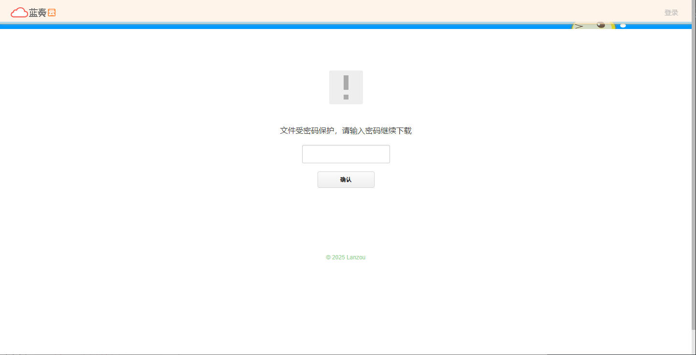

2. 输入密码：**48lx**，下载压缩包及使用须知

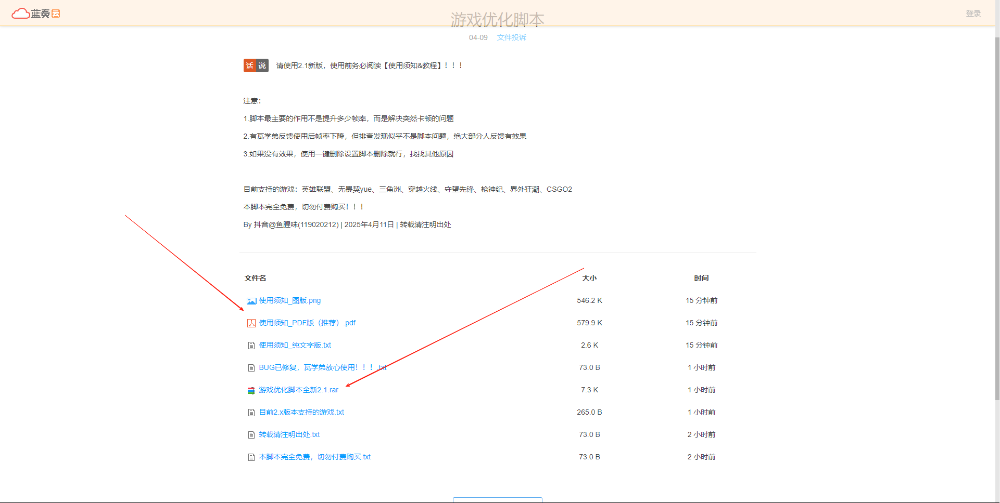

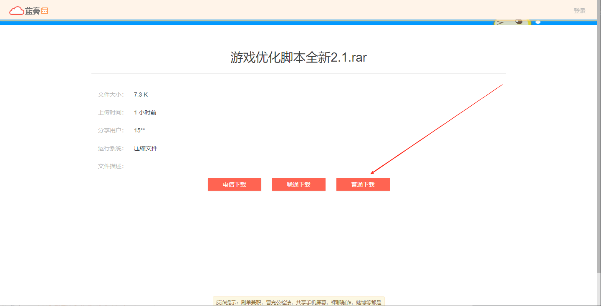

3. 把压缩包解压到你想储存的地方并进入文件夹

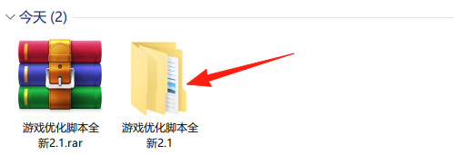

#### 2.初始设置（只需运行一次）

1. 右键`一键设置游戏优先级（注册表）_通用版.bat`选择`以管理员身份运行`

* 注：此脚本仅需运行一次，以后不需要再次运行

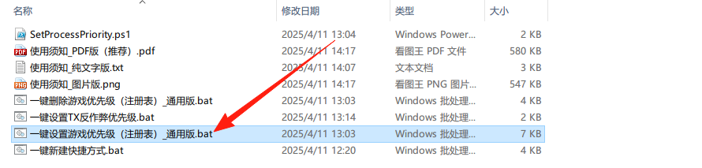

2. 运行后效果如下，如果有`WeGame`启动的游戏，则输入`Y`

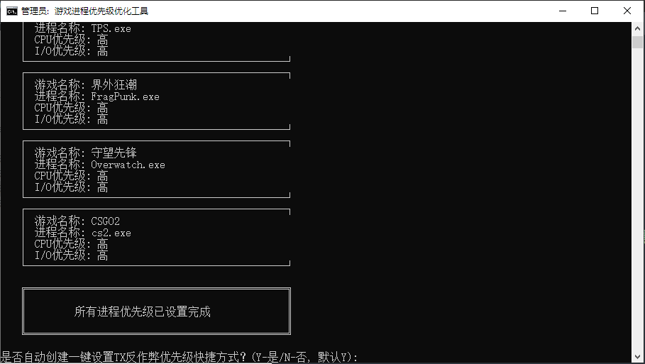

3. 我们选择`Y`，完成所有设置，然后**重启电脑**确保注册表生效

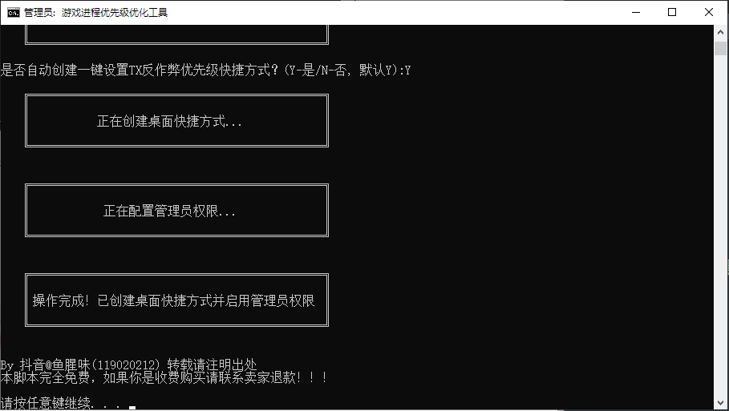

4. 如果自动创建失败，请双击文件夹内`一键新建快捷方式.bat`脚本手动创建

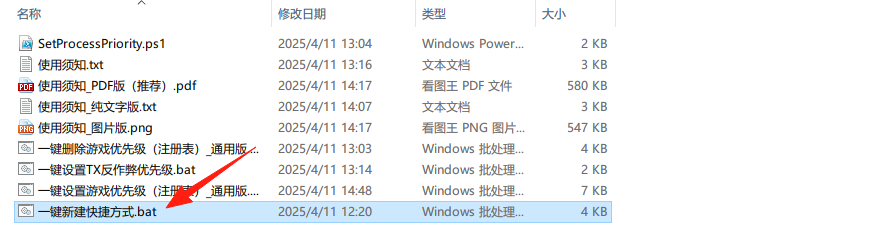

#### 3.日程使用（每次首次启动游戏后限制反作弊）

1. 每次首次启动游戏后双击桌面`一键设置TX反作弊优先级.bat` 快捷方式，这里作者并没有启动游戏所以显示未找到

* 至于`什么是首次启动？`、`为什么要运行这个脚本？`、`脚本都对反作弊进程做了什么？`请查看下方原理说明

* 注：有小伙伴反馈运行后显示`未找到进程SGuard.exe`，这个不用担心，因为这是32位系统的，大家现在的系统普遍为64位

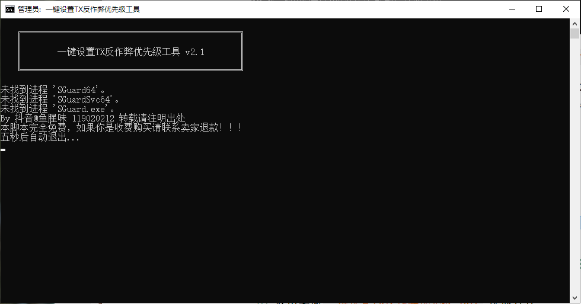  

#### 4.删除设置

1. 右键`一键删除游戏优先级（注册表）_通用版.bat`选择`以管理员身份运行`

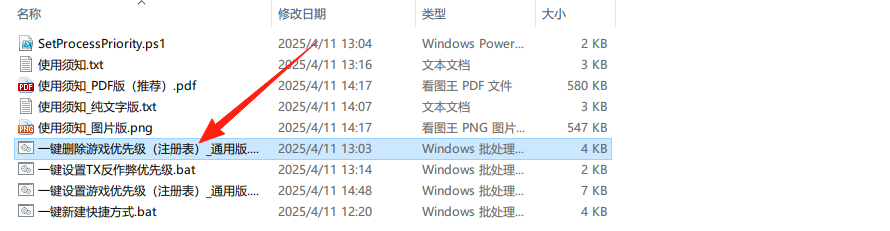

2. 我们选择`Y`，运行效果如下，即可完成删除，然后**重启电脑**确保注册表生效

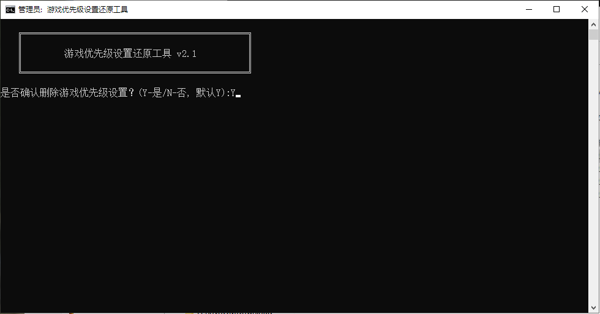

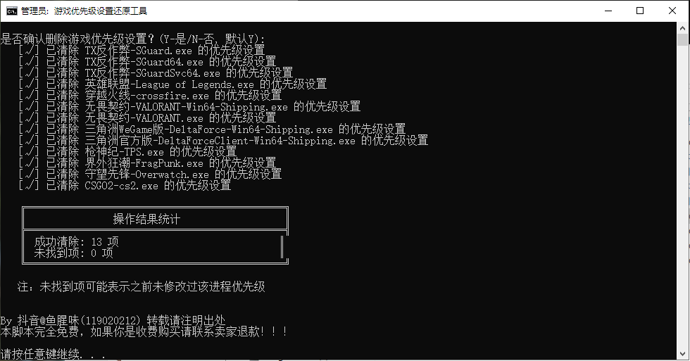

---

### ❓ 原理说明  
Q：为什么每次都要运行反作弊脚本？  
A：TX的SGuard64进程优先级无法通过注册表修改，需手动干预  

Q：何时算"首次启动"？  
A：游戏启动时出现**蓝色TX反作弊窗口**为首次启动，游戏启动后即可运行脚本，游戏未关闭则无需重复

Q：脚本都对TX反作弊进程做了什么？

A：脚本对TX反作弊进程的优先级设置为低，同时将CPU相关性绑定到CPU的最后一个逻辑核心，可以**大幅降低占用**，打开任务管理器右键`SGuard`开头的那几个进程就可以看到效果

---

### ⚠️ 注意事项  
• `一键设置反作弊优先级.bat` 和 `SetProcessPriority.ps1` **必须保持同目录**  
• 游戏优先级脚本使用完可删除，反作弊脚本**必须保留**  

---

### 🔍 常见问题  
**Q：会封号吗？**  
→ 绝对安全！仅调整系统调度规则，不修改游戏文件，主播长期实测  

**Q：帧率提升明显吗？**  
→多数反馈小伙伴有效，主播LOL实测提升10-20帧，显著改善团战卡顿。

**Q：脚本报错/链接失效？**  
→ 浏览器选择"保留文件"，链接问题请私信获取最新版本  

### 🔖 免责声明

本脚本仅供学习和技术研究使用，作者不对使用此脚本导致的任何后果负责，包括但不限于：
- 系统稳定性问题
- 性能表现差异

使用本脚本即表示您已了解并接受这些风险。如不同意，请勿使用。

---

**💬 其他问题？抖音私信秒回！**  

---

